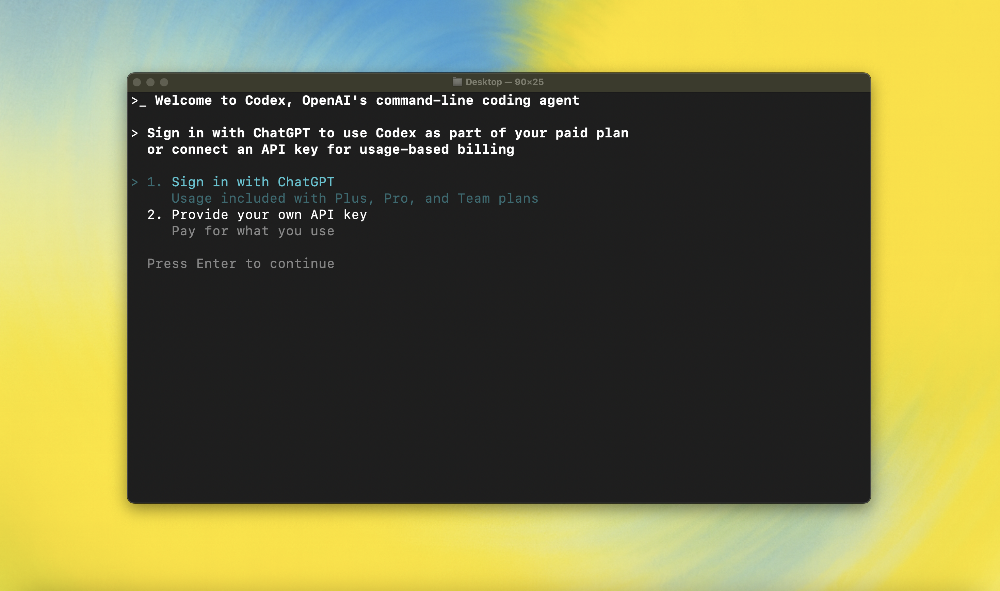

<h1 align="center">Codex CLI (Rust) — Local Agent + TUI</h1>

<p align="center">Local, terminal‑first coding agent with a Rust core and TUI.</p>

<p align="center">
  
  </p>

---

## Overview
This repository contains the open‑source CLI implementation of a local coding agent:

- Streams model output and reasoning.
- Executes tools with sandboxing and explicit user approval.
- Provides a ratatui‑based terminal UI that writes chat history into terminal scrollback.

The codebase is a Rust workspace with multiple crates.

## Repository Layout
codex-rs/
  core/     # Conversation engine, tools (conv_*, shell, apply_patch), providers, sessions/tasks
  tui/      # ratatui UI (composer, status indicator, transcript overlay, snapshots/fixtures)
  login/    # Authentication helpers for the CLI
  apply-patch/ ... other crates used by core/tui
```
Tests live next to source files and in dedicated `tests/` and `snapshots/` folders.

## Prerequisites
- Rust (stable) + Cargo
- Optional: `just` for convenience (`brew install just` or see upstream docs)
- macOS, Linux, and Windows supported

## Build & Run
```bash
git clone <this-repo>
cd codex-rs
cargo build --workspace

# Run the terminal UI
cargo run -p codex-tui --
```

Format and lint before commits:
```bash
cargo fmt --all
cargo clippy --workspace -D warnings
```

Run tests:
```bash
cargo test --workspace
cargo test -p codex-core   # or -p codex-tui
```

## Tools, Conversations, and UI
- Tools: `conv_create`, `conv_send`, `shell`, `apply_patch`, plus optional MCP tools.
- Pairing invariant: every tool output sent to the model must have a matching tool call
  (same `call_id`) in the same turn. The engine ensures this for conv_* flows and during
  auto‑compact.
- TUI: bottom pane shows the composer and status indicator; transcript is written directly
  into scrollback. While running, the status shows a short conversation id (e.g., `[conv abcdef12] agentx`).

## Sandboxing & Approvals
Commands run under a sandbox by default. Actions that write outside the workspace, require
network access, or change protected files may request approval. Policies are configurable
in `~/.codex/config.toml` and via CLI flags.

## Configuration
Configuration is loaded from Codex home (e.g., `~/.codex/config.toml`). Provider/model
settings, sandbox policy, and approval behavior can be adjusted here. See crate docs and
inline comments for available options.

## Contributing
Please read `AGENTS.md` for contributor guidelines:
- Style, naming, formatting, and clippy expectations
- Test practices (unit/integration, snapshots, determinism)
- Commit messages and PR requirements

<details>
<summary>You can also go to the <a href="https://github.com/openai/codex/releases/latest">latest GitHub Release</a> and download the appropriate binary for your platform.</summary>

Each GitHub Release contains many executables, but in practice, you likely want one of these:

- macOS
  - Apple Silicon/arm64: `codex-aarch64-apple-darwin.tar.gz`
  - x86_64 (older Mac hardware): `codex-x86_64-apple-darwin.tar.gz`
- Linux
  - x86_64: `codex-x86_64-unknown-linux-musl.tar.gz`
  - arm64: `codex-aarch64-unknown-linux-musl.tar.gz`

Each archive contains a single entry with the platform baked into the name (e.g., `codex-x86_64-unknown-linux-musl`), so you likely want to rename it to `codex` after extracting it.

</details>

### Using Codex with your ChatGPT plan

<p align="center">
  
  </p>

Run `codex` and select **Sign in with ChatGPT**. We recommend signing into your ChatGPT account to use Codex as part of your Plus, Pro, Team, Edu, or Enterprise plan. [Learn more about what's included in your ChatGPT plan](https://help.openai.com/en/articles/11369540-codex-in-chatgpt).

You can also use Codex with an API key, but this requires [additional setup](./docs/authentication.md#usage-based-billing-alternative-use-an-openai-api-key). If you previously used an API key for usage-based billing, see the [migration steps](./docs/authentication.md#migrating-from-usage-based-billing-api-key). If you're having trouble with login, please comment on [this issue](https://github.com/openai/codex/issues/1243).

### Model Context Protocol (MCP)

Codex CLI supports [MCP servers](./docs/advanced.md#model-context-protocol-mcp). Enable by adding an `mcp_servers` section to your `~/.codex/config.toml`.


### Configuration

Codex CLI supports a rich set of configuration options, with preferences stored in `~/.codex/config.toml`. For full configuration options, see [Configuration](./docs/config.md).

---

### Docs & FAQ

- [**Getting started**](./docs/getting-started.md)
  - [CLI usage](./docs/getting-started.md#cli-usage)
  - [Running with a prompt as input](./docs/getting-started.md#running-with-a-prompt-as-input)
  - [Example prompts](./docs/getting-started.md#example-prompts)
  - [Memory with AGENTS.md](./docs/getting-started.md#memory--project-docs)
  - [Configuration](./docs/config.md)
- [**Sandbox & approvals**](./docs/sandbox.md)
- [**Authentication**](./docs/authentication.md)
  - [Auth methods](./docs/authentication.md#forcing-a-specific-auth-method-advanced)
  - [Login on a "Headless" machine](./docs/authentication.md#connecting-on-a-headless-machine)
- [**Advanced**](./docs/advanced.md)
  - [Non-interactive / CI mode](./docs/advanced.md#non-interactive--ci-mode)
  - [Tracing / verbose logging](./docs/advanced.md#tracing--verbose-logging)
  - [Model Context Protocol (MCP)](./docs/advanced.md#model-context-protocol-mcp)
- [**Zero data retention (ZDR)**](./docs/zdr.md)
- [**Contributing**](./docs/contributing.md)
- [**Install & build**](./docs/install.md)
  - [System Requirements](./docs/install.md#system-requirements)
  - [DotSlash](./docs/install.md#dotslash)
  - [Build from source](./docs/install.md#build-from-source)
- [**FAQ**](./docs/faq.md)
- [**Open source fund**](./docs/open-source-fund.md)

---

## License

This repository is licensed under the [Apache-2.0 License](LICENSE).

<details>
<summary>You can also go to the <a href="https://github.com/openai/codex/releases/latest">latest GitHub Release</a> and download the appropriate binary for your platform.</summary>

Each GitHub Release contains many executables, but in practice, you likely want one of these:

- macOS
  - Apple Silicon/arm64: `codex-aarch64-apple-darwin.tar.gz`
  - x86_64 (older Mac hardware): `codex-x86_64-apple-darwin.tar.gz`
- Linux
  - x86_64: `codex-x86_64-unknown-linux-musl.tar.gz`
  - arm64: `codex-aarch64-unknown-linux-musl.tar.gz`

Each archive contains a single entry with the platform baked into the name (e.g., `codex-x86_64-unknown-linux-musl`), so you likely want to rename it to `codex` after extracting it.

</details>

### Using Codex with your ChatGPT plan

<p align="center">
  
  </p>

Run `codex` and select **Sign in with ChatGPT**. We recommend signing into your ChatGPT account to use Codex as part of your Plus, Pro, Team, Edu, or Enterprise plan. [Learn more about what's included in your ChatGPT plan](https://help.openai.com/en/articles/11369540-codex-in-chatgpt).

You can also use Codex with an API key, but this requires [additional setup](./docs/authentication.md#usage-based-billing-alternative-use-an-openai-api-key). If you previously used an API key for usage-based billing, see the [migration steps](./docs/authentication.md#migrating-from-usage-based-billing-api-key). If you're having trouble with login, please comment on [this issue](https://github.com/openai/codex/issues/1243).

### Model Context Protocol (MCP)

Codex CLI supports [MCP servers](./docs/advanced.md#model-context-protocol-mcp). Enable by adding an `mcp_servers` section to your `~/.codex/config.toml`.


### Configuration

Codex CLI supports a rich set of configuration options, with preferences stored in `~/.codex/config.toml`. For full configuration options, see [Configuration](./docs/config.md).

---

### Docs & FAQ

- [**Getting started**](./docs/getting-started.md)
  - [CLI usage](./docs/getting-started.md#cli-usage)
  - [Running with a prompt as input](./docs/getting-started.md#running-with-a-prompt-as-input)
  - [Example prompts](./docs/getting-started.md#example-prompts)
  - [Memory with AGENTS.md](./docs/getting-started.md#memory--project-docs)
  - [Configuration](./docs/config.md)
- [**Sandbox & approvals**](./docs/sandbox.md)
- [**Authentication**](./docs/authentication.md)
  - [Auth methods](./docs/authentication.md#forcing-a-specific-auth-method-advanced)
  - [Login on a "Headless" machine](./docs/authentication.md#connecting-on-a-headless-machine)
- [**Advanced**](./docs/advanced.md)
  - [Non-interactive / CI mode](./docs/advanced.md#non-interactive--ci-mode)
  - [Tracing / verbose logging](./docs/advanced.md#tracing--verbose-logging)
  - [Model Context Protocol (MCP)](./docs/advanced.md#model-context-protocol-mcp)
- [**Zero data retention (ZDR)**](./docs/zdr.md)
- [**Contributing**](./docs/contributing.md)
- [**Install & build**](./docs/install.md)
  - [System Requirements](./docs/install.md#system-requirements)
  - [DotSlash](./docs/install.md#dotslash)
  - [Build from source](./docs/install.md#build-from-source)
- [**FAQ**](./docs/faq.md)
- [**Open source fund**](./docs/open-source-fund.md)

---

## License

This repository is licensed under the [Apache-2.0 License](LICENSE).
