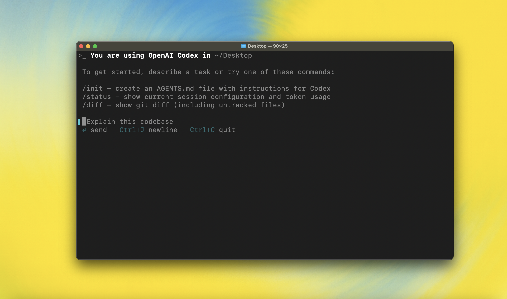

<h1 align="center">Codex CLI (Rust) — Local Agent + TUI</h1>

<p align="center">Local, terminal‑first coding agent with a Rust core and TUI.</p>

<p align="center">
  
</p>

---

## Overview
This repository contains the open‑source CLI implementation of a local coding agent:

- Streams model output and reasoning.
- Executes tools with sandboxing and explicit user approval.
- Provides a ratatui‑based terminal UI that writes chat history into terminal scrollback.

The codebase is a Rust workspace with multiple crates.

## Repository Layout
```
codex-rs/
  core/     # Conversation engine, tools (conv_*, shell, apply_patch), providers, sessions/tasks
  tui/      # ratatui UI (composer, status indicator, transcript overlay, snapshots/fixtures)
  login/    # Authentication helpers for the CLI
  apply-patch/ ... other crates used by core/tui
```
Tests live next to source files and in dedicated `tests/` and `snapshots/` folders.

## Prerequisites
- Rust (stable) + Cargo
- Optional: `just` for convenience (`brew install just` or see upstream docs)
- macOS, Linux, and Windows supported

## Build & Run
```bash
git clone <this-repo>
cd codex-rs
cargo build --workspace

# Run the terminal UI
cargo run -p codex-tui --
```

Format and lint before commits:
```bash
cargo fmt --all
cargo clippy --workspace -D warnings
```

Run tests:
```bash
cargo test --workspace
cargo test -p codex-core   # or -p codex-tui
```

## Tools, Conversations, and UI
- Tools: `conv_create`, `conv_send`, `shell`, `apply_patch`, plus optional MCP tools.
- Pairing invariant: every tool output sent to the model must have a matching tool call
  (same `call_id`) in the same turn. The engine ensures this for conv_* flows and during
  auto‑compact.
- TUI: bottom pane shows the composer and status indicator; transcript is written directly
  into scrollback. While running, the status shows a short conversation id (e.g., `[conv abcdef12] agentx`).

## Sandboxing & Approvals
Commands run under a sandbox by default. Actions that write outside the workspace, require
network access, or change protected files may request approval. Policies are configurable
in `~/.codex/config.toml` and via CLI flags.

## Configuration
Configuration is loaded from Codex home (e.g., `~/.codex/config.toml`). Provider/model
settings, sandbox policy, and approval behavior can be adjusted here. See crate docs and
inline comments for available options.

## Contributing
Please read `AGENTS.md` for contributor guidelines:
- Style, naming, formatting, and clippy expectations
- Test practices (unit/integration, snapshots, determinism)
- Commit messages and PR requirements

## License
See `LICENSE` for licensing terms. By contributing, you agree to the project’s license
and contribution policies. 
